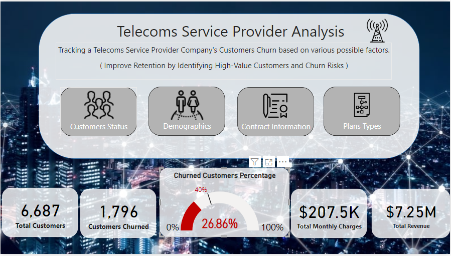
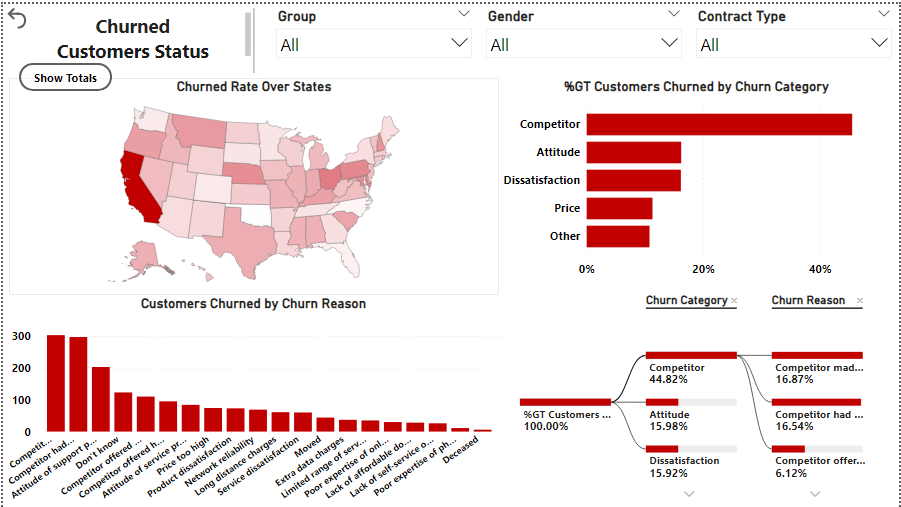
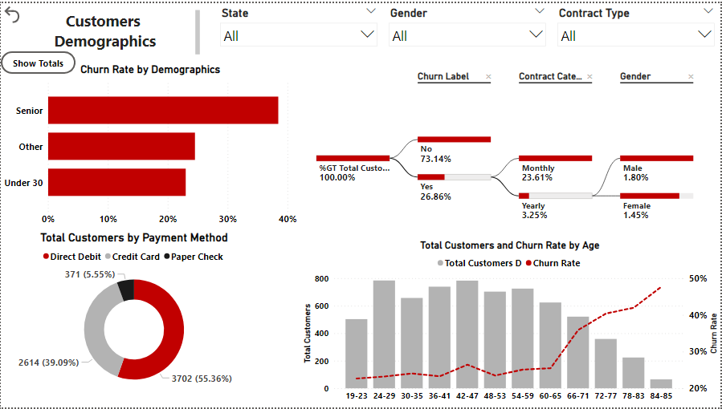
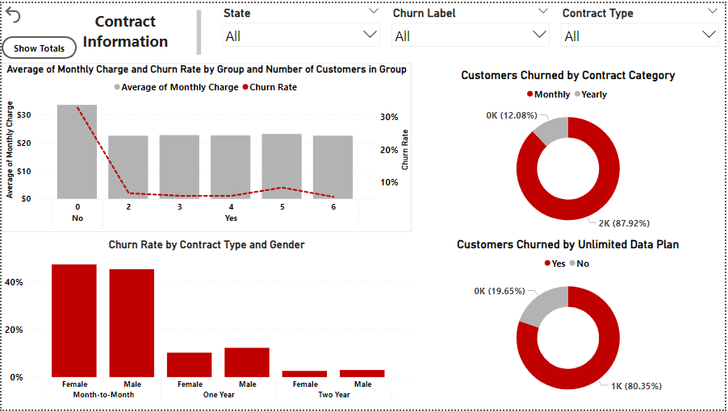

# Telecom Customers Churned 

<h1>Telecom Churn Dashboard: Insights and Recommendations.</h1>

I recently created a Power BI dashboard to analyze customer churn for a telecom service provider company. The dashboard contains four pages:

Overview:
This page provides an overview of the data, including the total number of customers, the number of churned customers, and the churn rate.

Churned Customers Status:
This page shows the churn rate by different customer statuses, such as gender, age, and contract type.

Customers Demographics:
This page shows the churn rate by different customer demographics, such as age, gender, and location.

Contract Information:
This page shows the churn rate by different contract types, such as month-to-month, one-year, and two-year contracts.

Unlimited Data Plan and International Plan:
This page shows the relationship between unlimited data plans and international plans and churn.

The dashboard also includes a number of insights and recommendations, such as:

The churn rate is highest for customers who are older, male, and on month-to-month contracts.

Customers who are on an unlimited data plan are more likely to churn if they consume less than 10 GB of data per month.

Customers who have had their account for less than 12 months are more likely to churn.

Customers who have had a negative customer service experience are more likely to churn.

Customers who are on unlimited data plans are more likely to churn and customers who are on international plans are more likely to churn.

Customers who have had a international plan subscription and not have international activity are more likely to churn.

I believe that these insights and recommendations can help the telecom company to reduce its churn rate.

Call to action:

If you are interested in learning more about the dashboard or the insights and recommendations, please contact me.

I hope this helps!

